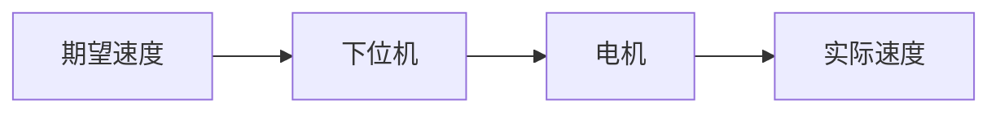
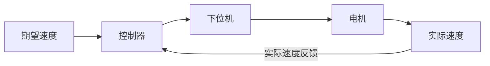
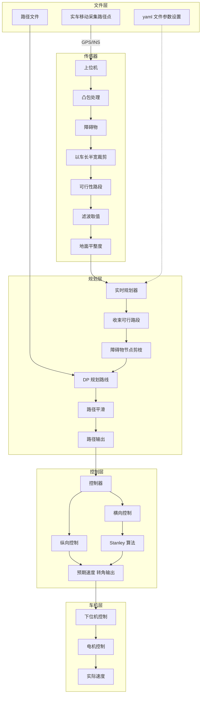

# WUTIB 规控组 2026 秋季招新题

> 文档编号：DWG. WUTIB-CTRL-QB-2026-A ｜ 版本：v3.3 ｜ 共 7 页
> 配套参考答案：[wutib-planning-control-2026-fall-recruitment-exam-answers.md](./wutib-planning-control-2026-fall-recruitment-exam-answers.md)

---

## 答题说明

1. 本题册共 9 道题，题目按方向以 **通用 / 规控 / 思维类** 标注。
2. 答案请写在答题区，写清题号，无需抄题；答题空间不足可自行续页。
3. 标注 **思维类** 的题目共 5 道，请选择其中 2 道作答；其余题目尽可能多地作答。
4. 鼓励尽可能多地作答，也鼓励使用 AI 辅助理解——但必须完成深入理解，做到有总结、有反思的闭环学习。
5. 标注 **通用** 的题目全体同学均可作答，标注 **规控** 的题目为规控方向题目。
6. 面试时将依据你的答卷进行提问，请对自己的每一个答案负责。

---

## 题目速览

| 题号 | 方向 | 内容 | 题量 |
|---|---|---|---|
| 01 | 通用 | 开环 / 闭环速度控制（图 1-1） | 3 问 |
| 02 | 通用 | 技术基础：ROS 2 / SSH / 双系统 / Git | 5 问 |
| 03 | 规控 | 带阻尼 Stanley 控制器：代码分析与公式推导 | 2 问 |
| 04 | 规控 | 系统架构与规控（图 2-1） | 6 问 |
| 05 | 思维类 | Ubuntu 版本选择 | 五选二 |
| 06 | 思维类 | 对数学的认识 | 五选二 |
| 07 | 思维类 | 大学展望与大学生活 | 五选二 |
| 08 | 思维类 | 主人翁意识及其异化 | 五选二 |
| 09 | 思维类 | 车队自动驾驶理解（图 3-1） | 五选二 |

---

## 题 01 　通用 　读图分析 · 控制基础　（3 问）

某速度控制系统的两种实现方案框图如图 1-1 所示。请读图回答下列问题。

**图 1-1　速度控制系统两种方案框图**

方案一（上图）：



方案二（下图）：



1. 图示两方案中，哪一个为**闭环控制**，哪一个为**开环控制**？在智能巴哈比赛环境中，哪种控制策略更适合？请说明理由。
2. 哪一项**期望速度与实际速度的拟合度**更高？为什么？
3. 在人工智能领域有一词为"**强化学习**"，试探讨其与闭环控制的联系。

---

## 题 02 　通用 　技术基础　（5 问）

本题考察技术基础与开发环境。

1. 什么是 **ROS 2 部署环境**？ROS 2 部署在什么系统中？请解释下列术语：

   | 术语 TERM | 含义 DEFINITION |
   |---|---|
   | 节点 Node | |
   | 订阅 Subscribe | |
   | 发布 Publish | |
   | 时间戳 Timestamp | |
   | 消息 Message | |
   | 定时器 Timer | |
   | 生命周期节点 Lifecycle | |
   | 话题 Topic | |
   | 回调 Callback | |

2. SSH 连接是我们把电脑上的代码部署到车上的重要方式。请介绍什么是 **SSH 连接**。若此时需要两台电脑仅利用一根网线传输信息，请写出**操作流程**。
3. **双系统和虚拟机**在我们的代码开发中起到重要作用。请介绍它们在使用时的区别，以及各自的**适用条件**。
4. Git 在代码迭代过程中非常重要。什么是 **Git**？Git 的工作区有哪些，分别有什么作用？

   | 区域名称 AREA | 作用 ROLE |
   |---|---|
   | | |
   | | |
   | | |
   | | |

5. **GitHub** 是一个非常著名的代码交流平台，它与我们所使用的 Git 有什么**区别**？在我们团队的协作中，需要使用 GitHub 吗？**为什么**？

---

## 题 03 　规控 　代码分析 · 推导　（2 问）

下列代码实现了一个**带阻尼的 Stanley 横向控制器**。请阅读后回答下列问题。

```python
import numpy as np

class StanleyDamped:
    # 带阻尼的 Stanley 横向控制器（前轮转向）

    def __init__(self, k_e=0.6, k_s=1.0, k_d=0.10,
                 delta_max=np.deg2rad(40.0)):
        self.k_e = k_e          # 横向误差增益
        self.k_s = k_s          # 低速软化系数 (m/s)
        self.k_d = k_d          # 阻尼增益 (s)
        self.delta_max = delta_max

    def _wrap(self, angle):
        # 角度归一化到 [-pi, pi]
        return (angle + np.pi) % (2 * np.pi) - np.pi

    def steer(self, x, y, yaw, v, r, path):
        # 1) 搜索最近路径点（最近邻）
        dx = np.asarray(path['x']) - x
        dy = np.asarray(path['y']) - y
        idx = int(np.argmin(dx**2 + dy**2))

        # 2) 航向误差 = 路径切向角 - 车辆航向角
        theta_e = self._wrap(path['yaw'][idx] - yaw)

        # 3) 横向误差: 前轴到路径的垂距（左为正）
        e = -dx[idx] * np.sin(yaw) + dy[idx] * np.cos(yaw)

        # 4) Stanley 主项
        v_eff = abs(v) + self.k_s          # 低速软化，防除零
        delta_st = theta_e + np.arctan2(self.k_e * e, v_eff)

        # 5) 阻尼项: 作用于横摆角速度偏差
        #    基准为路径曲率对应的期望横摆率 r_ref = v * kappa
        r_ref = v * path['kappa'][idx]
        delta = delta_st - self.k_d * (r - r_ref)

        # 6) 转角限幅
        return float(np.clip(delta, -self.delta_max, self.delta_max))
```

1. 上述代码描述了一个简单的 **Stanley 算法**。谈谈你对 Stanley 的认识。
2. 请写出该代码所描述的**数学公式**。

---

## 题 04 　规控 　架构分析 · 大题　（6 问）

结合图 2-1 所示系统架构，回答下列问题。

**图 2-1　车队自动驾驶系统架构**



1. Frenet 坐标系在自动驾驶领域高频使用。什么是 Frenet 坐标系？它如何在我们转弯降速、判断道路偏离距离、收束可行路段、输出可用路径时发挥作用？
2. DP 代价是控制工程中常用的方法。在我们的算法中，需要将哪些考虑进入代价计算？
3. 在规划器和控制器的实现流程中，哪些部分需要传感器数据的参与？具体需要哪些数据？
4. 在规划时，车整体被收束为一点，用于规划的起点。请问该点所处在的车身位置位于哪里？
5. 当出现信号干扰，其在传输链条中发生大幅延迟时，车身数据会出现非常严重的错误。例如：当车高速行驶时，若车接收信号出现高度延迟，车拟合 GPS/INS 定位发生滞后偏移，以至于后续输出全为错误。如何解决这样的问题？
6. 该算法设置意在完成 A3 模式的跟随路径的赛规要求，在 A5 条件下为完全自主驾驶。谈谈你对完全自主驾驶算法的认识（例如 A* 等）。

---

## 题 05 ~ 题 09 　思维类 　以下 5 道任选 2 道作答

作答时标清题号。

### 题 05 　Ubuntu 版本选择

最新版 Ubuntu 系统已经更新到 26，但我们团队内仍在使用 22.04 版本，为什么？在工程软件的使用中有哪些注意要点？

### 题 06 　对数学的认识

我们常说数学是所有理论的基础，谈谈你对数学的认识。

### 题 07 　大学展望与大学生活

目前进入大学，你有哪些展望？对你而言，想要怎样的大学生活？

### 题 08 　主人翁意识及其异化

谈谈什么是主人翁意识，什么是被异化的主人翁意识。

### 题 09 　车队自动驾驶理解（图 3-1）

根据下图，谈谈你对我们车队自动驾驶的理解。

> 图 3-1　车队自动驾驶系统架构（与图 2-1 同，见题 04 Mermaid 架构图）

---

## 评分与面试记录（附页）

### 答卷完成情况核对

| 题号 | 要求 | 已作答题号 | 达标 |
|---|---|---|---|
| 01-04（通用/规控） | 尽量多答 | | |
| 05-09（思维类） | 五选二 | | |
| **AI 辅助使用情况** | | | |

### 面试评分（满分 100）

| 评分维度 | 观察要点 | 分值 | 得分 |
|---|---|---:|---:|
| 基础概念掌握 | 题 01–02 作答的准确性与表述清晰度 | 20 | |
| 方向专业深度 | 题 03 (Stanley) 与题 04 (规控架构) 的理解深度 | 25 | |
| 工程与推导 | 从代码反推数学公式的能力、推导严谨度与数量级判断 | 20 | |
| 思维与表达 | 题 05–09 的视角、权衡意识与逻辑表达 | 20 | |
| 学习闭环 | 是否有总结与反思、AI 辅助是否合理、追问应对 | 15 | |
| **总分** | | **100** | |

综合评语 / 面试追问记录：（空白）

面试官签字 ________ 　复审签字 ________ 　日期 ________

---

> 本册仅用于 WUTIB 智能巴哈车队招新评估，题目内容请勿外传。
